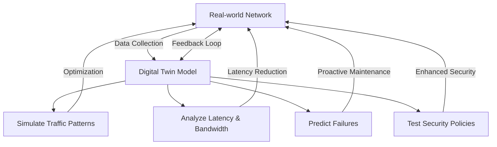

### Case Study: Digital Twin for Computer Networks

#### Background
Digital Twins (DTs) have emerged as a revolutionary technology that replicates physical systems in the digital world. In computer networking, DTs simulate real-time network operations and enable predictive analytics to enhance network reliability, efficiency, and resilience. A network digital twin (NDT) models the behavior of an actual network to analyze, test, and optimize operations virtually, offering a solution to meet the needs of growing and complex network infrastructure.

#### Problem
As organizations rely on increasingly complex network infrastructures, managing and optimizing network performance becomes challenging. Network downtime, suboptimal configurations, cybersecurity vulnerabilities, and unexpected latency issues can severely impact operations. Traditional network management systems are limited in their ability to simulate changes or identify issues in real-time. Thus, organizations seek an innovative solution to improve visibility, prevent outages, and optimize network performance.

#### Solution
The implementation of an NDT enables a continuous, real-time digital mirror of network activities. Using data from network components, the NDT recreates the topology, configurations, device behaviors, and data flows of the actual network in a simulated environment. This digital replica helps in:

1. **Real-time Monitoring**: The DT visualizes network traffic, device statuses, and data flows, allowing for proactive monitoring of network health.
2. **Predictive Maintenance**: By analyzing historical data, the NDT predicts potential failures and alerts administrators before actual breakdowns occur.
3. **Configuration Testing and Optimization**: The DT can simulate changes and optimizations, such as load balancing, new configurations, or software updates, ensuring these adjustments are safe before deployment in the physical network.
4. **Cybersecurity**: The DT identifies vulnerabilities by simulating cyber-attacks, testing firewall configurations, and validating security policies.
5. **Scalability and Future Planning**: As network demands grow, the DT tests scalability strategies, such as new device integration or increased traffic loads, before implementing these changes physically.

#### Implementation

1. **Data Collection**: Collects data from various network components such as routers, switches, and access points.
2. **Digital Model Construction**: Creates a replica of the network topology, configurations, and routing paths based on real-world data.
3. **Simulation and Testing**: Runs simulations on the DT to test performance under different conditions, such as peak loads or hardware failures.
4. **Feedback and Optimization**: Uses insights from simulations to optimize network configurations, improve security policies, and preemptively address potential issues.

#### Results

An organization that implemented an NDT for its network infrastructure experienced a **30% reduction in network downtime** and improved **efficiency by 25%** through optimized configurations. Predictive maintenance reduced **costs associated with reactive repairs** by 20%, while simulated security tests enhanced overall cybersecurity posture by identifying and mitigating vulnerabilities proactively.

#### Diagram

Here's a visual representation of a Digital Twin for Computer Networks:

